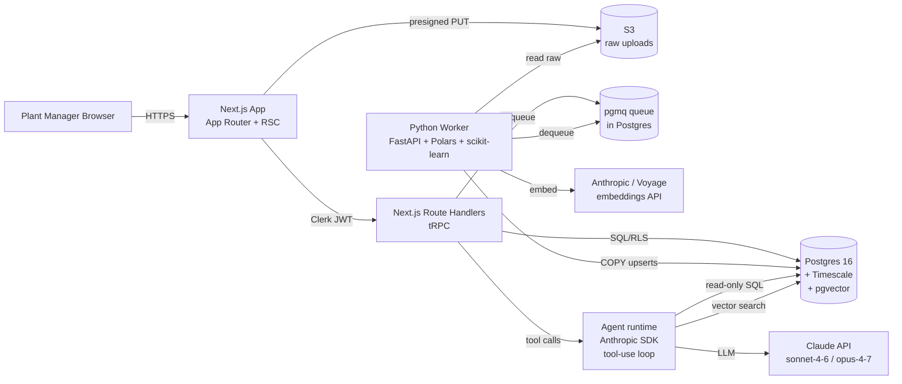

# Mining Intelligence Platform — v1.0.0 Technical Design & Delivery Plan

> Status: planning artifact, pre-MVP. Opinionated. Pushback included where the brief asked for it.
> Audience: solo founder/engineer. Optimized for one developer shipping to one design-partner customer, without painting v2.0 into a corner.

---

## 0. TL;DR (read this if nothing else)

- **The product is not "a dashboard with AI." It's an outlier registry with a UI on top.** Outliers are first-class rows in a table, with their own lifecycle (detected → explained → linked → acted-on). Everything else is a view over that table.
- **Stack recommendation:** Postgres (Timescale extension) + pgvector + S3 + a Python worker + Next.js. No separate graph DB. No ClickHouse. No microservices. One database, one app, one worker, one queue.
- **Pushback #1 — chat-as-primary surface is wrong for a plant manager.** Plant managers triage. They want a shift summary with a "why" button next to each anomaly, not a chat box they have to think up prompts for. Build the agent as an *embedded explainer* first, expose it as chat second.
- **Pushback #2 — graph DB is aspirational right now.** Channel→channel relationships and outlier clusters are 5–10 rows of FK joins, not a Neo4j cluster. Revisit at customer #10.
- **Pushback #3 — "ML-based outlier detection" is premature.** With zero labels and one customer, robust statistics (rolling median + MAD + Mahalanobis on grouped features) will outperform an unsupervised neural model and is debuggable on a Tuesday morning. Add Isolation Forest as a second opinion. Defer deep models until you have ≥6 months of labels.
- **Critical-path risk:** the outlier *explanation* is the product. If the agent's explanations aren't right, no architecture saves you. Build the eval set in week 1 with the design-partner, before you build the agent.

---

## 1. Clarifying Questions

Numbered. **B = blocker for sprint zero**, **N = nice-to-have, can default**.

### Domain & data

1. **(B)** What system is the customer exporting the Excel from? PortaMetrics, WipFrag, Split Online, custom? — If it's a known vendor, we may have a direct DB/API path and CSV upload becomes the v1.0 expedient, not the destination.
2. **(B)** Can the customer share **6–12 months of historical data** *and* point at known-bad windows ("this week we had a blockage on CV42")? Without labels, the agent's "explain + predict" claim has no grading rubric.
3. **(B)** What does *downstream impact* mean numerically to this customer? Tonnes/hour lost? Unplanned downtime minutes? Quality (recovery %)? Without one target metric, "predict impact" is unfalsifiable.
4. **(B)** Ingest cadence — is the Excel produced once per day, per shift, per channel? This determines whether ETL is a nightly batch or a per-upload job.
5. **N** How many channels does the design-partner site have today? (Affects UI density, not architecture.)
6. **N** Are there scheduled events (blasts, planned stops, belt changeovers) we can tag as known outlier sources?
7. **N** Do channels feed each other physically (CV42 → CV43)? If yes, list the topology. This is the only thing that justifies a graph view.

### Product & users

8. **(B)** Is the plant manager's current workflow "look at the dashboard each morning" or "respond to alerts"? If alerts, we need a notification channel (email? SMS? Teams?) in v1.0.0 — not in your scope list.
9. **(B)** What is *acceptable freshness* after CSV upload? 1 minute? 10 minutes? An hour? Drives whether the worker is sync or async.
10. **N** Does the customer have an SSO IdP they want to use (Azure AD/Entra is common in mining)? If yes, we wire it in v1.0.0; if not, magic-link is fine.

### Operations & compliance

11. **(B)** Data residency requirements. Mining customers in AU/CL/CA/ZA often require in-country storage. This decides cloud region and possibly cloud vendor.
12. **N** Is the customer comfortable with their data sitting in our cloud account, or do they want a dedicated tenancy? Affects multitenancy posture (see §4.4).
13. **N** What's the expected price point? It changes whether we can afford a managed Postgres ($) or need self-hosted ($$$ engineering time).

### Roadmap signals

14. **N** When does v1.1 streaming ingest need to be live? If "within 6 months," the ETL seam matters more than if "within 18 months."
15. **N** Is there a second pilot customer in the pipeline? If yes within 6 months, multitenancy stops being theoretical.

**Minimum unblock set:** answers to 1, 2, 3, 4, 8, 9, 11. The rest can use defaults from §2.

---

## 2. Assumptions Log

Defaults adopted where the brief didn't specify. Correct any of these and the plan adjusts.

| # | Assumption | Reversible? |
|---|---|---|
| A1 | Cloud: AWS, single region (`us-east-1` or customer's region). | Yes, easily. |
| A2 | Ingest cadence: 1–3 CSV uploads/day, batch. | Yes. |
| A3 | Acceptable freshness: < 2 min from upload to visible in dashboard. | Yes. |
| A4 | Data is non-PII, non-regulated (no HIPAA/PCI). SOC2-ready posture, not certified at v1.0.0. | Yes, but late changes are painful. |
| A5 | Customer accepts our cloud tenancy for v1.0.0. | Yes. |
| A6 | One channel name per row; channels enumerated lazily on first sight. | Yes. |
| A7 | "Outlier" at v1.0.0 = per-channel, per-feature, time-windowed statistical anomaly (median+MAD), promoted to "event" when ≥K features fire in a window. | Yes — detector is swappable. |
| A8 | Agent uses Anthropic Claude. `claude-sonnet-4-6` default; `claude-opus-4-7` for the "explain outlier" deep-reasoning tool only. Prompt caching on system prompt and schema. | Yes. |
| A9 | Auth: Clerk (managed) for v1.0.0. Don't roll your own. | Yes — Clerk → WorkOS is a known migration. |
| A10 | Multitenancy: `tenant_id` column + Postgres RLS. Schema-per-tenant deferred to customer ≥10. | Yes, but a forklift if we wait too long. |
| A11 | Hosting: Fly.io (app + worker) + a managed Postgres with Timescale (Timescale Cloud or Neon-with-pg_timeseries). S3 for raw files. | Yes. |
| A12 | Frontend: Next.js App Router, TypeScript, Tailwind, shadcn/ui, Tremor or visx for charts (NOT generic Recharts — outlier-preserving rendering needs control). | Yes. |
| A13 | Backend: FastAPI worker in Python (for ETL + numerics); Next.js Route Handlers for app API. tRPC or plain REST. | Yes. |
| A14 | Queue: Postgres-backed (Graphile Worker or `pgmq`) — avoids adding Redis until needed. | Yes. |
| A15 | Volume planning target: 25M rows/year/mine, 5 mines/customer → 125M rows/yr per customer; ~50 customers in 18 months is the upper plan target. Timescale handles this comfortably with hypertables and compression. | Yes. |

---

## 3. Architecture Proposal

### 3.1 Components



### 3.2 Data flow (ingest path)

1. Plant manager drags CSV into browser.
2. Frontend gets a **presigned S3 URL** from `/api/uploads`, PUTs the file directly (skip the app server bandwidth).
3. App writes an `uploads` row (status=`pending`) and enqueues a `parse_upload` job into `pgmq`.
4. Worker dequeues, streams the file from S3 with Polars (lazy scan), normalizes locale (comma→dot), validates schema against a registered channel template, COPYs into `measurements`.
5. Worker runs the detector over the new rows (windowed; see §6), writes `outliers`, generates window embeddings, writes `outlier_embeddings`.
6. Worker marks `uploads.status = ready`, notifies the app via Postgres `LISTEN/NOTIFY`.
7. UI revalidates and shows new data + new outliers.

### 3.3 Major decisions with trade-offs

#### D1. Storage substrate

| Option | Pros | Cons |
|---|---|---|
| **Postgres + Timescale + pgvector** *(recommended)* | One DB, one transactional model, RLS for multitenancy, pgvector co-located with rows, columnar compression (Timescale) wins on the time-series side, every cloud has a managed option. Solo dev can operate it. | Vector search at scale (>10M vectors) is weaker than dedicated vector DBs. Not a problem at our scale for 18 months. |
| ClickHouse + Postgres + pgvector | Best columnar/compression performance, fastest analytical scans. | Two DBs to operate, two consistency stories, ClickHouse mutations are clumsy for an outlier registry that updates rows. Overkill for 125M rows/yr/customer. |
| QuestDB / InfluxDB + Postgres | Purpose-built TSDB. | Same two-DB cost, weaker SQL surface, smaller ecosystem. |
| Snowflake/BigQuery + Postgres | Infinite scale, zero ops. | Cost model punishes interactive dashboards; per-query latency too high for the "drill into 02:47" workflow. Save for offline analytics later. |

**Decision:** Timescale + pgvector. Revisit ClickHouse if a single customer exceeds 1B rows or analytical p95 degrades past 2s on 90-day windows.

#### D2. Graph layer

| Option | Pros | Cons |
|---|---|---|
| **No graph DB; model edges as Postgres tables** *(recommended)* | Zero new infra. Channel topology, outlier→outlier similarity, event→event causation are all FK tables. | If we ever do >3-hop traversals at interactive latency, we'll feel it. |
| Apache AGE (Postgres extension) | Cypher on Postgres if we need it. | Adds operational surface; AGE is still maturing. |
| Neo4j | Best-in-class graph queries. | Separate cluster, separate ops, no real v1.0.0 use case meets the bar. |

**Decision:** relational edges. Revisit only when a real query needs ≥3 hops at interactive latency.

#### D3. Deployment topology

| Option | Pros | Cons |
|---|---|---|
| **Fly.io app + worker + Timescale Cloud + S3** *(recommended for v1.0.0)* | One ops surface, multi-region trivially when needed, low fixed cost. | Fly's database story is weaker — that's why DB is managed externally. |
| AWS ECS Fargate + RDS + S3 | Enterprise-grade, easy to sell to mining IT. | More YAML, more IAM, slower for one dev. |
| Vercel (Next.js) + Render (worker) + Neon + S3 | Best DX. | Three vendors, three bills, Neon's Timescale story is via `pg_timeseries` which is less mature. |

**Decision:** Fly + Timescale Cloud + S3 today. Add an AWS deployment recipe when an enterprise customer demands it (it's a Terraform job, not a rewrite).

#### D4. Backend language split

| Option | Pros | Cons |
|---|---|---|
| **Next.js (TS) app + Python (FastAPI) worker** *(recommended)* | TS where the UI lives, Python where the numerics live (Polars, scikit-learn, statsmodels). Each in its native ecosystem. | Two languages to maintain. Acceptable — the seam is narrow (a job queue). |
| All-TypeScript (Node worker w/ apache-arrow + onnxruntime) | One language. | You'll fight the ecosystem for every statistical primitive. Bad trade for a solo dev. |
| All-Python (Litestar/FastHTML + Jinja or HTMX) | One language. | Modern interactive charts are a TS world. The UI brief (glassmorphism + dense) is much easier in React. |

**Decision:** TS frontend, Python worker, narrow seam.

#### D5. AI agent shape

See §7. Headline: **single agent, tool-use loop, read-only tools**. Not an orchestrator.

---

## 4. Data Model

Schema-first, opinionated. All tables have `tenant_id`, RLS policies enforce `tenant_id = current_setting('app.tenant_id')`. Times are `timestamptz`.

### 4.1 Core tables

```sql
-- Tenancy & identity
tenants            (id PK, name, created_at, region, settings jsonb)
users              (id PK, tenant_id FK, email, role enum('plant_manager',...), clerk_id, created_at)
api_keys           (id PK, tenant_id FK, hashed_key, scopes jsonb, created_at, revoked_at)  -- v1.1 surface, table exists now

-- Domain: channels & uploads
channels           (id PK, tenant_id FK, name, site, kind, schema_version, metadata jsonb,
                    UNIQUE(tenant_id, name))
channel_schemas    (id PK, channel_id FK, version, columns jsonb, created_at)   -- supports schema drift
uploads            (id PK, tenant_id FK, user_id, s3_key, filename, rows_total, rows_loaded,
                    status enum('pending','parsing','loaded','failed','ready'),
                    error_message, started_at, completed_at)

-- Measurements: the hot path, hypertable
measurements       (tenant_id, channel_id, iteration_time timestamptz, iteration_count bigint,
                    topsize, f90, f80, ..., f10,
                    sieve_6000in, ..., sieve_00165in,
                    sd_ratio_10_5,
                    video_r, video_g, video_b, hue, saturation, lightness,
                    upload_id FK,
                    PRIMARY KEY (tenant_id, channel_id, iteration_count))
-- Convert to hypertable on iteration_time, partition by tenant_id,
-- enable compression after 7 days, compress by (tenant_id, channel_id) order by iteration_time desc.
```

### 4.2 Outliers as first-class entities (the important one)

This is the registry. **Outliers are not a flag on `measurements`.** They are rows with their own lifecycle, links, embeddings, and explanations. This is what makes the "outlier survives at weekly zoom" feature possible — you join the outliers table at any zoom level and render them as overlays.

```sql
outliers (
  id              uuid PK,
  tenant_id       FK,
  channel_id      FK,
  measurement_pk  (channel_id, iteration_count),   -- references measurements row
  detected_at     timestamptz,
  event_time      timestamptz,                     -- = measurements.iteration_time
  method          enum('mad_zscore','mahalanobis','isolation_forest','rule','human'),
  severity        smallint,                        -- 1..5
  score           double precision,                -- raw detector score
  features        jsonb,                           -- which columns fired and by how much
  status          enum('new','triaged','explained','acknowledged','dismissed'),
  classification  text,                            -- 'oversize_event', 'segregation', 'camera_fault', null
  explanation     text,                            -- agent-written, last version
  explanation_model text,                          -- e.g. 'claude-opus-4-7'
  explanation_at  timestamptz,
  acknowledged_by uuid FK users,
  acknowledged_at timestamptz
)

outlier_embeddings (
  outlier_id      FK,
  window_kind     enum('pre_30m','symmetric_30m','post_30m','features_only'),
  embedding       vector(1024),                    -- Voyage voyage-3 or Anthropic
  created_at      timestamptz,
  PRIMARY KEY (outlier_id, window_kind)
)
CREATE INDEX ON outlier_embeddings USING hnsw (embedding vector_cosine_ops);

outlier_links (
  src_outlier_id  FK,
  dst_outlier_id  FK,
  kind            enum('similar','temporal_neighbor','co_classified','causal_candidate'),
  weight          real,
  PRIMARY KEY (src_outlier_id, dst_outlier_id, kind)
)

-- Aggregates: derived views, not source of truth.
CREATE MATERIALIZED VIEW measurements_hourly ... ;     -- Timescale continuous aggregate
CREATE MATERIALIZED VIEW outliers_daily ... ;          -- count, max severity per channel per day
```

### 4.3 Agent surfaces

```sql
agent_sessions     (id PK, tenant_id, user_id, started_at, ended_at, persona)
agent_messages     (id PK, session_id FK, role, content, tool_calls jsonb, tool_results jsonb,
                    model, input_tokens, output_tokens, cache_read_tokens, created_at)
agent_evals        (id PK, dataset_id, outlier_id FK, expected jsonb, predicted jsonb,
                    grader_model, score, created_at)
```

### 4.4 Multitenancy posture

- **v1.0.0 → v1.x:** shared schema, `tenant_id` column on every row, **Postgres RLS** policies enforce isolation, every connection sets `SET LOCAL app.tenant_id = ...` from a verified JWT claim.
- **Trigger to escalate to schema-per-tenant or DB-per-tenant:** an enterprise customer with a data-residency or "no logical co-tenancy" clause. Build the migration tool when you need it; do not pre-build.
- **API key scoping (v1.1):** `api_keys.scopes` carries `tenant_id` + capabilities. Same RLS path.

### 4.5 Wide-table vs. tall-table

The sample row has ~35 numeric columns. Two viable shapes:

- **Wide** (recommended): one column per metric. Fastest reads, easiest Mahalanobis, easiest UI. Risk: schema drift between channels/vendors.
- **Tall** (`measurements_long(channel_id, iteration_count, metric, value)`): infinite flexibility, terrible read latency for "give me 30 days of F80 + Topsize".

**Decision:** wide table with a `metrics_raw jsonb` sidecar column for any unrecognized columns. Promote columns from JSONB to typed columns via migrations when they stabilize. This is the "schema-on-write but soft" pattern.

---

## 5. ETL & Outlier-Detection Plan

### 5.1 Ingest pipeline (worker)

```
S3 object → Polars lazy scan
          → decimal-comma normalize (locale=de_DE-ish)
          → parse IterationTime (multiple date formats; reject unparseable rows to a quarantine table, do not fail the whole upload)
          → validate against channel_schemas.columns (warn on new column, fail on missing required)
          → derive tenant_id, channel_id (upsert channel on first sight)
          → idempotent upsert into measurements ON CONFLICT (tenant_id, channel_id, iteration_count) DO NOTHING
          → return (rows_loaded, rows_new, rows_dup, rows_quarantined)
```

Notes:
- **Idempotency** matters: customers will re-upload the same file. Use `(channel_id, iteration_count)` as the natural key.
- **Bulk path**: write to a staging table, then `INSERT ... SELECT ... ON CONFLICT DO NOTHING` into the hypertable. Faster than per-row upserts.
- **Quarantine** unparseable rows; do not silently drop. The whole point of the product is "don't lose outliers."

### 5.2 Outlier detection — opinionated recommendation

**Goal:** preserve outliers, don't average them. So detection runs on **raw rows**, never on aggregates.

Use a **two-stage ensemble**:

**Stage A — per-feature robust z-score (fast, runs on every row at ingest):**
- For each numeric column, maintain a rolling window of the last N=2000 values per channel (≈ 1–2 days at typical cadence).
- Compute robust z-score: `z = 0.6745 * (x - median) / MAD`. Threshold at `|z| > 3.5`.
- Why MAD/median, not mean/stdev: outliers contaminate the mean and stdev, which is *literally the bug the customer is trying to fix in Excel.* The whole point is robustness.

**Stage B — multivariate, per feature-group (runs on candidate rows):**
- Group features semantically: PSD percentiles (F10–F90, Topsize), sieve passings, video stats.
- For each group, fit a rolling **Mahalanobis** distance on the same window. Threshold at the 99.5th percentile of historical distances.
- A row is promoted to an `outlier` row when **(stage A fires on ≥2 features in a group) OR (stage B fires)**. This kills most univariate noise while keeping true multivariate anomalies.

**Stage C — second opinion (runs nightly, not at ingest):**
- **Isolation Forest** (`sklearn.ensemble.IsolationForest`) over the last 30 days per channel.
- If iForest flags a row that Stage A/B missed, create an outlier with `method='isolation_forest'` and lower default severity. Cheap insurance against blind spots in the statistical detector.

**What I'm explicitly NOT recommending for v1.0.0:**
- LSTM autoencoders, AnomalyTransformer, deep one-class models. Reason: no labels, one customer, one dev. They're a research project, not a feature.
- Prophet/STL decomposition. Reason: requires assumptions about seasonality we haven't validated; the customer's data may not be strongly seasonal.

**Re-evaluate the detector** when: (a) you have ≥30 labeled events from the design-partner, OR (b) the false-positive rate from the agent's perspective exceeds ~30%.

### 5.3 Embeddings for similarity search

- For each promoted outlier, compute an embedding of a **±15 minute window** around the event.
- Two embedding strategies, pick one:
  - **(Recommended for v1.0)** Featurized: concatenate normalized z-scores across the window into a fixed vector (e.g. 35 features × 30 timesteps = 1050-dim), L2-normalize, store directly. Cheap, deterministic, no API dependency. Good enough for "find similar past events."
  - **(v1.1)** Learned: train a small contrastive encoder once you have labeled "these two events are similar" pairs from the plant manager's acknowledgements.
- Use pgvector HNSW. Top-K=10 is plenty for the UI.

---

## 6. AI Agent Design

### 6.1 Shape

**Single agent, tool-use loop. Not an orchestrator.** A solo dev cannot debug an orchestrator-of-specialists in production. Add specialists only when a tool surface gets unwieldy (>15 tools or >2k tokens of tool descriptions).

Two entry points to the same agent:
1. **Embedded explainer** — for each outlier card in the UI, a "Why?" button opens a fixed-prompt invocation: *"Explain outlier X to a plant manager. Likely cause. Likely downstream impact. Suggested action."* (This is the **primary surface**.)
2. **Chat** — the same agent, free-form prompt, same tools. Secondary surface for ad-hoc questions ("how was night shift on CV42?").

### 6.2 Model strategy

- Default model: `claude-sonnet-4-6` (fast, cheap, plenty smart for shift summaries and routine outlier explanations).
- Escalation model: `claude-opus-4-7` for the "deep explain" path on severity ≥4 outliers, and for the eval-grading LLM-as-judge.
- **Prompt caching is mandatory.** System prompt + schema docs + tool descriptions + the plant-manager persona block go into a cached prefix. Targeting >80% cache-read ratio.
- Use Anthropic SDK with `tool_use` + parallel tool calls enabled.

### 6.3 Tool surface (read-only for v1.0.0)

```
list_channels(site?: str) -> [{id, name, last_seen}]
get_channel_summary(channel_id, window: "last_shift" | "last_24h" | "last_7d") -> stats
get_measurements_window(channel_id, t_from, t_to, columns?) -> rows  (capped 5000)
get_outliers(channel_id?, since?, until?, min_severity?, status?) -> [outlier]
get_outlier(outlier_id) -> {outlier, surrounding_window, features_breakdown}
find_similar_outliers(outlier_id, k=10) -> [outlier with cosine_distance]
get_shift_summary(date, shift: "day"|"night") -> {throughput_proxy, outlier_count, top_channels}
get_channel_topology(channel_id) -> {upstream:[], downstream:[]}        # empty in v1.0.0 unless wired
search_outliers_by_text(query, k=20) -> [outlier]                       # vector search on explanations
```

**Not in v1.0.0:** any write tool. The agent cannot acknowledge, classify, or label. A human does that via the UI. (Once you have human-in-the-loop telemetry, you can add `propose_classification` as a write tool with mandatory confirmation.)

### 6.4 Persona / system prompt scaffolding

```
You are the assistant for the plant manager at <site>. You speak in metric units,
short sentences, and you lead with the bottom line. You never make up numbers; if
you don't have data, you call a tool. You explain outliers in three parts:
  1. What happened (one sentence, with the numeric specifics from the tool).
  2. Likely cause (one or two candidates, ranked, each with the evidence).
  3. Likely downstream impact and suggested next check.
You never recommend stopping the plant unless severity is 5 and you cite the rule.
You always link to the outlier id in the form [outlier:<uuid>].
```

System prompt is structured: `<persona>`, `<schema>` (table dictionary, tiny), `<tools>` (autoinjected by SDK), `<style_rules>`, `<safety>` (no plant-shutdown recommendations without rule citation).

### 6.5 Evaluation strategy

**Build the eval set in week 1.** Before any agent code.

1. **Golden set:** with the design-partner, label 30 historical outliers (target: 5 per likely class). Each has: `event_time`, `channel`, `expert_cause`, `expert_impact`, `expert_action`.
2. **Auto-grader:** `claude-opus-4-7` as judge with a strict rubric — does the agent's `cause` match the expert's? Use exact-match on `classification` + LLM-judge on `explanation` text, scored 0/1/2.
3. **Online metrics:** acknowledgement rate ("plant manager clicked acknowledge after reading the explanation" = signal of usefulness), dismissal rate, time-to-acknowledge.
4. **Regression gate:** every prompt change reruns the golden set. Don't ship if score drops.
5. **Cost/latency budgets:** p95 first-token < 1.5s, p95 full response < 8s, avg cost/outlier explanation < $0.02. If you blow either, investigate before adding features.

---

## 7. Front-End Design Brief (one-pager — paste into design tool)

> **Product**: Mining Intelligence Platform (working name TBD).
> **User**: Plant Manager at an industrial mining site. Senior, time-poor, technically literate, distrusts toy dashboards.
> **Primary device**: 27" desktop monitor at the plant office. Secondary: laptop. Not mobile.
> **Mood**: serious, restrained, modern. Linear / Vercel / Things-3 lineage. Not Tableau, not Grafana, not "industrial Bootstrap."

**Aesthetic**
- Dark mode primary (`#0A0B0E` background, surface elevated by ~3% lightness, never pure black, never pure white).
- Glassmorphism used **sparingly** — only on floating panels (drill-downs, agent panel, command palette). Body content sits on solid elevated surfaces. Glass blur ≤ 16px, never above the fold.
- High information density. Comfortable line-height (1.45) but tight vertical padding. Multi-column where the eye can scan.
- 8px spacing grid. 4px micro-grid for numeric tables.

**Typography**
- Sans: Inter or Geist Sans. Weights 400 / 500 / 600 only.
- Mono (numbers, IDs, code): Geist Mono or JetBrains Mono.
- **Tabular numerals everywhere a number appears.** `font-variant-numeric: tabular-nums`. No exceptions.
- Type scale: 12 / 13 / 14 / 16 / 20 / 28. Body 14. No 18.

**Color**
- Neutrals: 11-step gray scale, OKLCH-defined, dark-mode tuned. Foreground at L=92 (not 100), muted at L=60.
- Brand accent: a desaturated cyan (think `#7EB6FF`-ish) for interactive affordance — links, focus rings, primary buttons.
- **Signal palette** (not siren):
  - sev 1 (info): muted blue
  - sev 2 (notice): muted teal
  - sev 3 (watch): warm amber
  - sev 4 (alert): orange — used for outlier glyphs at all zooms
  - sev 5 (critical): red — used sparingly, with a soft glow not a solid block
- Outlier markers on charts: **diamond glyphs**, sev-colored fill, white 1px stroke for contrast on any background. Never disappear at zoom-out; they survive downsampling because they're rendered from the `outliers` table, not from the measurement series.

**Layout — main dashboard**
- Left nav: 56px collapsed icon-rail. Site/channel switcher at top.
- Top bar: site name, shift indicator (Day/Night with current shift highlighted), upload button (drag target = whole window).
- Body: 3-column grid by default:
  - **Col 1 (wide):** time-series chart for the focused channel, with outlier overlay. Zoomable, brushable, never smoothing into invisibility.
  - **Col 2:** outlier queue ("Today's anomalies"), sortable by severity/time. Each row has a "Why?" button.
  - **Col 3:** PSD curve snapshot and color/video stats for the current selection.
- Bottom: shift summary strip (last 24h KPIs).

**Agent surface**
- Embedded "Why?" → opens a side-panel (right edge, 480px), glassmorphic, showing the agent's structured explanation (Cause / Impact / Action) with citations linking back to the chart selection.
- Free chat: `⌘K` palette opens a command bar; agent chat is one of the modes.

**Motion**
- Chart series animate on data update at 180ms ease-out. No hover-only motion.
- Panels slide in at 240ms. No spring physics.
- **No skeleton shimmer.** Use a tasteful 2px progress bar at the top of the viewport during loads.

**Don'ts**
- No emoji.
- No iconography that implies "factory cute" (no smiling helmets).
- No gradient backgrounds behind text.
- No tooltips that obscure the data they explain.
- No modal dialogs for anything that could be a side panel.

---

## 8. Phased Delivery Plan

Realistic milestones for a solo dev. Each milestone is shippable to the design-partner. Estimates are calendar weeks assuming ~30 focused hours/week.

### M0 — Foundations (week 1)
- Repo, CI, Fly app skeleton, Timescale Cloud DB, S3 bucket, Clerk tenant.
- One Next.js page authenticated end-to-end.
- **Eval set kickoff with design-partner — label 10 historical outliers.** (Not a code task. Schedule it now.)
- **Exit criterion:** I can log in, the DB exists, S3 works, CI is green.

### M1 — Ingest & storage (weeks 2–3)
- CSV upload UI (drag-drop, presigned PUT, progress).
- Python worker: parse, locale-normalize, validate, bulk-insert into `measurements` hypertable.
- `uploads` lifecycle, idempotent re-upload.
- Channels auto-registered.
- **Exit:** customer can upload a real CSV; rows are queryable; re-upload is a no-op.

### M2 — Multitenancy & RLS (week 4)
- `tenant_id` everywhere, RLS policies on every table, JWT → `SET LOCAL app.tenant_id`.
- Negative test: a second tenant cannot see the first's rows.
- **Exit:** RLS smoke tests pass; one staging tenant; production has the design-partner.

### M3 — Outlier detection (weeks 5–6)
- Stage A (MAD z-score) at ingest.
- Stage B (Mahalanobis per feature group) at ingest.
- Stage C (Isolation Forest) nightly.
- `outliers` table populated, severity assigned, embeddings written.
- **Exit:** on the design-partner's historical data, ≥80% of their labeled outliers are detected. (If not, tune before moving on.)

### M4 — Visualization (weeks 7–9)
- Time-series chart with outlier overlay (visx or Tremor; render outliers from the `outliers` table so they survive zoom).
- Outlier queue with severity, time, channel.
- PSD curve view.
- Drill-down side panel with raw row + surrounding window.
- **Exit:** plant manager can find the 02:47 outlier at weekly zoom without thinking.

### M5 — AI agent (weeks 10–12)
- Tool layer (§7.3) implemented as Python functions, exposed to the agent runtime.
- Anthropic SDK tool-use loop, prompt caching configured.
- "Why?" button on each outlier → calls agent with fixed prompt → renders structured Cause/Impact/Action.
- Eval harness: golden set runs on every prompt change, blocks regressions.
- **Exit:** ≥70% golden-set pass rate; p95 explanation latency < 8s; cost < $0.02/explanation.

### M6 — Chat surface + polish (weeks 13–14)
- `⌘K` agent chat (same agent, free-form).
- Shift summary strip.
- Find-similar-outliers UI (vector search results).
- Onboarding nits, error states, empty states.
- **Exit:** design-partner uses it daily without you in the room.

### M7 — Launch hardening (week 15)
- Observability: structured logs, Sentry, OpenTelemetry traces on ingest + agent.
- Backups verified; restore drill.
- Runbook for "customer says data looks wrong."
- **Exit:** v1.0.0 GA to the design-partner.

### Critical path
**M1 → M3 → M5.** Ingest is upstream of everything; outlier detection is the substrate the agent reasons over; the agent is the product. M2 (multitenancy) and M4 (viz) parallelize partly but cannot start before M1. M6/M7 are unblocked after M5.

### v1.1 seam (designed in, not built)
- API keys table + scopes already exist; switching the agent's read tools to a public HTTP surface is "expose the existing functions through FastAPI + auth middleware."
- Streaming ingest: replace the "S3 upload" trigger with a Kafka/MQTT consumer producing the same staging-table rows. Worker logic unchanged.

---

## 9. Risk Register

| # | Risk | Likelihood | Impact | Mitigation |
|---|---|---|---|---|
| R1 | **Agent explanations are wrong/generic, eroding trust irrecoverably.** | High | Critical | Build the golden eval set in week 1. Gate every prompt change on it. Keep the embedded "Why?" the primary surface (constrained prompt) before the open chat (unconstrained). Show evidence (the actual rows/features) inline so the user can verify. |
| R2 | **No labels → outlier detector tuned wrong → high false positive rate → "alert fatigue" before launch.** | High | High | Robust statistics + multi-stage gating instead of single threshold. Tune K (number of features) and z-threshold on historical data with the design-partner. Make severity user-tunable in the UI. |
| R3 | **Schema drift between vendor exports breaks ingest silently.** | Medium | High | `channel_schemas` versioning + `metrics_raw jsonb` sidecar for unknown columns. Quarantine table, never silent-drop. Weekly "schema diff" digest emailed to ops. |
| R4 | **Multitenancy bug leaks data between tenants.** | Low | Catastrophic | RLS as the *only* tenancy mechanism — no application-level filtering as a "second layer" (which becomes the first layer when someone forgets). Negative tests in CI. Use a single DB role for the app and force `SET LOCAL app.tenant_id` in middleware. |
| R5 | **Solo-dev burnout / single point of failure.** | Medium | High | Boring stack (Postgres, Next, Python). Managed services where it doesn't hurt the product (Clerk, Timescale Cloud, Fly, Anthropic). Resist the urge to introduce Redis, Kafka, K8s, or a graph DB before they're load-bearing. |
| R6 | **Customer's "real" data shape diverges from the sample we have.** | Medium | High | Get 6–12 months of real exports before committing column-typed schema. Keep `metrics_raw` JSONB sidecar. Treat the wide-column schema as a migration target, not a constraint. |
| R7 | **LLM cost or latency surprises at scale.** | Medium | Medium | Prompt caching mandatory (target >80% cache-read ratio). Sonnet by default, Opus only on severity ≥4 explanations. Per-tenant token budgets with alerts. |
| R8 | **Embeddings/similarity is mediocre because featurized vectors are too coarse.** | Medium | Low (in v1.0) | Featurized embeddings are good enough for "find me similar moments." Plan a learned encoder for v1.1 *only* when "find similar" is being used and missing. Don't pre-train. |

---

## 10. Things I'd Push Back On If You Pushed

- **"Make the chat the front door."** It shouldn't be. Plant managers triage; a chat box is a blank page. The embedded "Why?" explainer is the front door. Chat is the back room.
- **"Graph DB so we can model channel relationships."** A `channel_edges` table with `(src, dst, kind)` covers v1.0–v1.x. The graph DB conversation starts when a query plan demonstrably needs it, not before.
- **"Let's also do streaming ingest in v1.0."** No. The seam is designed in; the implementation waits. Streaming brings backpressure, ordering, partial-window detection, and exactly-once semantics — every one of which is a sprint of its own.
- **"We need real-time alerts in v1.0."** Listed as out of scope but the brief implies real-time. If it sneaks in: add email/Teams webhook from the worker when an outlier of severity ≥4 is written. One day of work. Don't build a full notification framework.
- **"Use a vector DB like Pinecone/Weaviate."** Not at 125M rows/yr/customer and ≤10K outliers/month. pgvector wins on operability.
- **"Use a no-code BI tool for v1.0 to move faster."** It won't move faster — you'll spend the savings fighting the BI tool's chart model to keep outliers visible at zoom-out. The chart layer *is* the differentiator; own it.

---

## 11. Appendix — quick reference

### Columns in the sample row → semantic groups

- **Identifiers:** `ChannelName`, `IterationTime`, `ChannelIterationCount`
- **Particle-size percentiles (μm or mm depending on calibration):** `Topsize`, `F90`, `F80`, `F70`, `F60`, `F50`, `F40`, `F30`, `F20`, `F10`
- **Sieve passing %:** `6_000in`, `5_000in`, `4_000in`, `3_500in`, `3_000in`, `2_500in`, `2_000in`, `1_750in`, `1_500in`, `1_250in`, `1_000in`, `0_750in`, `0_500in`, `0_250in`, `0_187in`, `0_0937in`, `0_0165in`
- **Distribution shape:** `SDRatio10_5`
- **Video:** `Videoaverageredintensity`, `Videoaveragegreenintensity`, `Videoaverageblueintensity`, `AverageHue`, `AverageSaturation`, `AverageLightness`

### Naming normalization at ETL

- `6_000in` → `sieve_6000in` (column names must be SQL-safe)
- comma decimal → period decimal
- Empty cells → NULL, *not* zero. Zero is a real measurement.
- Times: try `%-d/%-m/%y`, `%-m/%-d/%y`, ISO; quarantine on failure.

---

*End of document. Iterate on §1 answers before §3 finalizes.*
